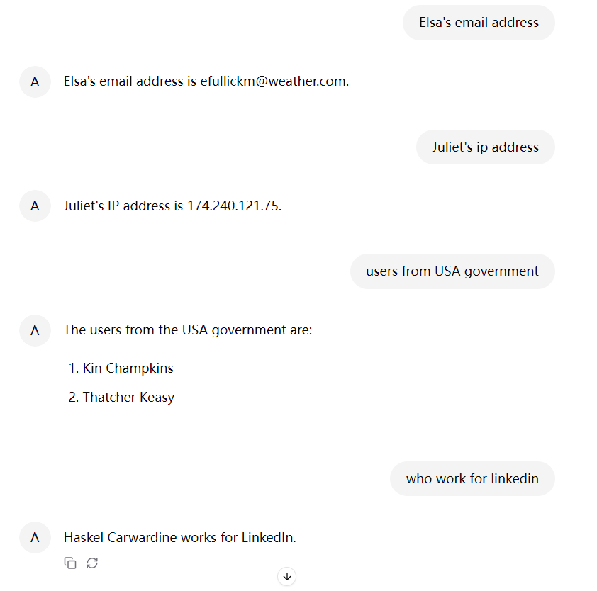

# LLM Agent Builder Example - CSV Processor

Process local CSV files.

Tools used:

* `readLocalFile`
* `writeLocalFile`

## Quick Start

Start the application and navigate to `http://localhost:8080`.

Sample CSV file can be found [here](test_data/input/users.csv).

Below is the screenshot of chatting with agent about this sample CSV file.

